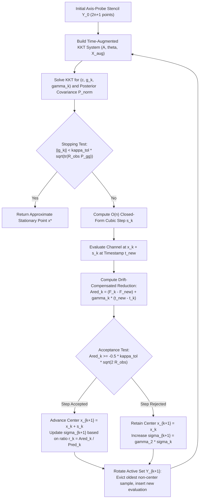

# TOBYQA: Time-Augmented Model-Based Derivative-Free Optimization

[](https://opensource.org/licenses/MIT)
[](https://www.python.org/downloads/)
[](Final_paper/main.pdf)

**TOBYQA** (**T**ime-augmented **O**ptimization **BY** **Q**uadratic **A**pproximation) is a regularized model-based derivative-free optimization (DFO) algorithm tailored for expensive black-box optimization problems under **measurement noise** and **nonstationary temporal drift**.

---

## Highlights & Theoretical Contributions

* **Joint Space--Time Model**: Augments the classical least-Frobenius-norm quadratic interpolation system with an explicit temporal drift column, resolving spatial geometry and temporal variation in a single saddle-point KKT solve.
* **Affine-Drift Invariance (Theorem 3.2)**: Under affine temporal drift $F(\boldsymbol{x}, t) = f(\boldsymbol{x}) + \beta t + \varepsilon$, the recovered spatial gradient is **algebraically invariant** to the drift rate $\beta$ for any noise scale and sample radius ($\boldsymbol{g} \equiv \boldsymbol{g}^{\mathrm{stat}}$).
* **Nonlinear-Drift Bias Bound (Theorem 3.3)**: Under general $C^2$ drift with $|\mu''(t)| \le L_\mu$, the gradient bias is rigorously bounded by $O(L_\mu \tau_{\max}^2)$, governed directly by the active-set temporal span $\tau_{\max}$.
* **Statistical Kernel Foundation (Proposition 3.4)**: Under a rotation-invariant Gaussian curvature prior, Powell's quadratic residual kernel $A_{ij} = \tfrac{1}{2}(\boldsymbol{d}_i^\top \boldsymbol{d}_j)^2$ is proven to be the exact covariance kernel of the omitted quadratic forms. The soft-constrained KKT estimator coincides with the Generalized Least Squares (GLS) estimator with optimal ridge parameter $\rho = \sigma_H^2 / \sigma_\varepsilon^2$.
* **$O(n)$ Closed-Form Step**: Driven by an adaptive cubic regularization scheme with an explicit analytical solution $\boldsymbol{s}_k = -\boldsymbol{g}_k / \sqrt{\sigma_k \|\boldsymbol{g}_k\|_2}$ requiring only $O(n)$ operations.
* **Optimal First-Order Complexity (Theorem 4.5)**: Achieves an oracle evaluation complexity of $O(L_g (f(\boldsymbol{x}_0) - f_{\mathrm{low}}) \varepsilon^{-2})$ above the statistical noise floor, matching the information-theoretic lower bound for first-order nonconvex optimization.

---

## Algorithmic Architecture



---

## Installation

### Prerequisites
* Python $\ge$ 3.9
* `numpy >= 1.22.0`
* `scipy >= 1.8.0`
* `matplotlib >= 3.5.0`

### Setup
```bash
# Clone the repository
git clone https://github.com/Haoyu-Yao/TOBYQA.git
cd TOBYQA

# Install required dependencies
pip install -r requirements.txt

# (Optional) Install in editable development mode
pip install -e .
```

---

## Quickstart

```python
import numpy as np
from TOBYQA import tobyqa_optimize

# 1. Define a noisy, time-varying black-box objective
def drifting_objective(x, t):
    # Latent static objective: Extended Rosenbrock
    f_latent = np.sum(100.0 * (x[1:] - x[:-1]**2)**2 + (1.0 - x[:-1])**2)
    # Nonstationary channel drift: Linear ramp + periodic oscillation
    channel_drift = 0.02 * t + 0.1 * np.sin(2.0 * np.pi * t / 50.0)
    # Measurement noise: N(0, sigma^2)
    noise = np.random.normal(0.0, 1e-3)
    return f_latent + channel_drift + noise

# 2. Configure optimization settings
n_vars = 4
x_start = np.full(n_vars, 0.5)
noise_std = 1e-3

# 3. Run TOBYQA
result = tobyqa_optimize(
    obj_func=drifting_objective,
    n_vars=n_vars,
    noise_std=noise_std,
    x_start=x_start,
    max_iter=600,
    verbose=1
)

print("\nOptimization Finished:")
print(f"  Best point: {result['x_best']}")
print(f"  Evaluations used: {result['n_evals']}")
print(f"  Early stopped: {result['early_stopped']}")
```

---

## Reproducing Paper Results

### 1. Mathematical Verifications (Section 5.3 & Proposition 3.4)
Run the automated verification scripts to validate the theoretical bounds:
```bash
# Verify Theorem 3.2 (Affine Invariance) and Theorem 3.3 (Nonlinear Drift Scaling)
python verify_drift_decoupling.py

# Verify Proposition 3.4 (Curvature Prior Covariance Kernel via Monte Carlo)
python verify_curvature_kernel.py
```

### 2. Running Benchmarks (Moré--Wild 65 Problems $\times$ 7 Channels)
The benchmark testbed comprises 65 unconstrained test problems across 7 observation channels (Static baseline, LinearDrift, PeriodicAdd, ChaoticDrift, Hetero, MultCoupling, PeriodicMult) and dimensions $n \in \{6, 10, 20\}$ with 5 random seeds:
```bash
# Quick sanity smoke test (8 problem instances)
python run_benchmark.py --smoke

# Full benchmark across all available CPU cores (writes to results/full65.sqlite)
python run_benchmark.py --db results/full65.sqlite --workers 16

# Analyze results and generate LaTeX tables into tables/
python run_benchmark.py --db results/full65.sqlite --analyze --latex-out tables/
```

### 3. Generating Figures
To reproduce the publication figures (Figure 1: Data Profiles, Figure 2: Solve Rate vs $\tau$ decay curves):
```bash
python gen_figures.py --db results/full65.sqlite --out Final_paper/figures
```

### 4. Compiling the Manuscript
The paper source files are located in `Final_paper/` using SIAM's `siamart171218` class:
```bash
cd Final_paper
pdflatex main
bibtex main
pdflatex main
pdflatex main
```
The compiled publication-ready manuscript is output to `Final_paper/main.pdf`.

---

## Repository Structure

```
TOBYQA/
├── README.md                      # Project documentation and quickstart
├── LICENSE                        # MIT License
├── pyproject.toml                 # Package metadata and build system
├── requirements.txt               # Python package dependencies
├── .gitignore                     # Git ignore rules for Python, LaTeX, and databases
├── __init__.py                    # Package export interface
│
├── TOBYQA.py                      # Core TOBYQA solver implementation
├── KKT_posterior.py               # Time-augmented KKT saddle-point solver & covariance
├── ARC_subproblem.py              # Cubic regularization subproblem & O(n) closed-form step
├── geometry_step.py               # Active set sample geometry management
│
├── verify_drift_decoupling.py     # Verification script for Theorems 3.2 and 3.3
├── verify_curvature_kernel.py     # Verification script for Proposition 3.4
│
├── bench_problems.py              # 65 Moré-Wild test problems & 7 observation channels
├── bench_solvers.py               # Solver interfaces (TOBYQA, NEWUOA, BOBYQA, Py-BOBYQA, etc.)
├── run_benchmark.py               # Multi-core SQLite benchmark execution & table generation
├── run_dimsweep.py                # Dimension-scaling experiment runner
├── run_alphasweep.py              # Regularization parameter sweep runner
├── bench_curvature_schemes.py     # Comparison of curvature models (Zero vs Interpolated vs Powell)
│
├── gen_figures.py                 # Matplotlib generation script for paper figures
├── plot_style.py                  # Publication-grade typography and palette configuration
│
├── Final_paper/                   # LaTeX manuscript for SIOPT submission
│   ├── main.pdf                   # Compiled PDF (23 pages, 0 errors, 0 overfull hboxes)
│   ├── main.tex                   # Master LaTeX document
│   ├── sec1_introduction.tex      # Section 1: Introduction
│   ├── sec2_setting_related.tex   # Section 2: TOBYQA Algorithm & Formulation
│   ├── sec3_method.tex            # Section 3: Theoretical Properties of Augmented System
│   ├── sec4_5_complexity.tex      # Section 4: Convergence & Complexity Analysis
│   ├── sec5_experiments.tex       # Section 5: Numerical Experiments & Ablations
│   ├── sec6_conclusion.tex       # Section 6: Conclusions & Open Questions
│   ├── references.bib             # Bibliography database
│   ├── figures/                   # High-resolution vector PDF & PNG figures
│   ├── tables/                    # LaTeX benchmark tables (solve rates, ablations, etc.)
│   └── TOBYQA_SIOPT_submission.zip# Self-contained submission archive
│
├── results/                       # Benchmark raw SQLite databases (full65.sqlite, etc.)
├── docs/                          # Detailed study notes and derivation records
└── archive/                       # Historical drafts and archived data
```

---

## Citation

If you use TOBYQA in your research, please cite our paper:

```bibtex
@article{YaoXie2026TOBYQA,
  author  = {Haoyu Yao and Pengcheng Xie},
  title   = {{TOBYQA}: A Time-Augmented Model-Based Method for Derivative-Free Optimization under Noise and Temporal Drift},
  journal = {SIAM Journal on Optimization},
  year    = {2026},
  note    = {Submitted}
}
```

---

## Contact

* **Haoyu Yao** (School of Computer Science and Technology, Xi'an Jiaotong University) — `yaohaoyu@stu.xjtu.edu.cn`
* **Pengcheng Xie** (Applied Mathematics and Computational Research Division, Lawrence Berkeley National Laboratory) — `pxie@lbl.gov` *(Corresponding Author)*
